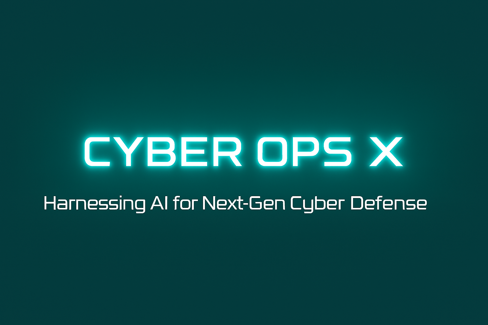
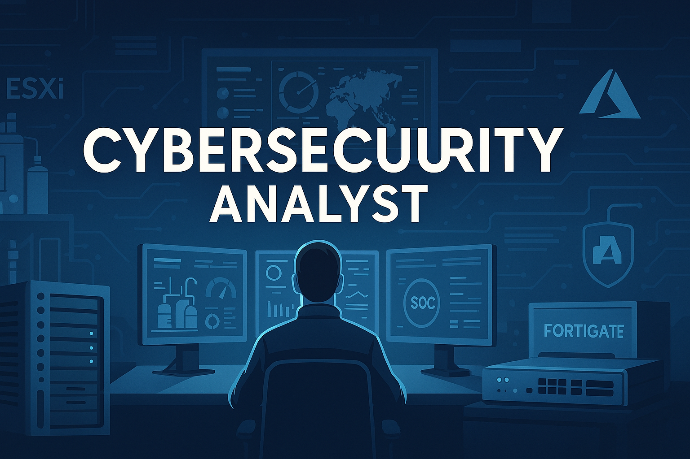

<!-- ========================================================= -->
<!-- 🌟 PREMIUM GITHUB PROFILE — JEAN SMAIL ORIGÈNE — CYBEROPSX -->
<!-- ========================================================= -->

<h1 align="center" style="
  color:#5ff0ff;
  text-shadow:0 0 20px #5ff0ff, 0 0 40px #5ff0ff;
  letter-spacing:3px;
  font-weight:700;
  font-size:44px;">
  CYBER OPS X
</h1>

<!-- ===== CYBEROPSX NEON BRANDING HEADER ===== -->

  

<h1 align="center">👋 Jean Smail Origène</h1>
<h3 align="center">Cybersecurity Analyst | IT/OT Convergence | Cloud Security | SOC Monitoring | BSc Cybersecurity | NSE 3 | CompTIA Security + | CompTia Network +| M365 Fundamentals</h3>

<!-- ===== SECONDARY SMALLER ANALYST BANNER ===== -->

  

<!-- Badges -->

  
  
  
  
  

## 🌐 About Me

I am a **cybersecurity analyst** focusing on:

✅ IT/OT convergence security  
✅ Cloud identity security (Entra ID / Conditional Access / PIM)  
✅ Hybrid SOC monitoring & telemetry engineering  
✅ Secure-by-design architecture for modern infrastructures  

I specialize in bridging **cloud, on-prem, and industrial environments**, aligning ICS security foundations (Purdue, ISA‑95, IEC 62443) with **DevSecOps**, automation, and real-world security monitoring.

📚 Currently preparing:  
**AZ‑500** • **SC‑300**

---

## 🚀 Skills & Expertise

### 🔐 Cybersecurity & Cloud Security
- Entra ID, Conditional Access, MFA, RBAC, PIM  
- Defender for Cloud • Secure baselines • Azure governance  
- Microsoft Sentinel (SIEM/SOC)  
- Zero Trust for hybrid IT/OT ecosystems  

---

### 🏭 Industrial Cybersecurity (ICS / SCADA)
- Protocols: **MQTT, OPC UA, DNP3, AMQP, CoAP**  
- ISA‑95 Purdue Model • IEC 62443 • NIST SP 800‑82  
- OT segmentation • SCADA secure remote access  
- Legacy ICS risk assessment  

---

### ⚙️ Infrastructure & Network Security
- ESXi virtualization • Secure lab architecture  
- FortiGate (NSE3) — firewalling, segmentation, automation  
- VLAN/VRF & routing for OT/IT convergence  

---

### 🤖 DevSecOps, Automation & Scripting
- Python (automation + tooling)  
- Linux (hardening, deployment, troubleshooting)  
- GitHub Actions (CI/CD pipelines)  
- Power Automate (SOC reporting pipelines)  

---

## 🎯 Areas of Interest
- OT/IT convergence & industrial cybersecurity  
- Cloud security engineering  
- SOC monitoring & log pipelines  
- ICS/SCADA architecture hardening  
- Cybersecurity automation & identity governance  
- DevSecOps applied to hybrid industrial systems  

---

# 🧪 Projects & Technical Work

## 🔹 CYBER OPS X  | AI‑Driven Hybrid Engineering Security Platform
A secure-by-design platform combining:

- **Hybrid cloud + ESXi on‑prem**  
- **Segmentation & OT/IT boundary controls (FortiGate)**  
- **WordPress hardened environment**  
- **OAuth2 + Microsoft Graph API secure mail pipeline**  
- **Telemetry ingestion & SOC automation**  
- **GitHub Actions CI/CD**  
- **Power Automate workflows for reporting**  

> CyberOpsX showcases how modern organizations can unify **OT monitoring**, **cloud identity**, and **secure automation** within a single coherent architecture.

---

# 🏗️ CYBER OPS X Engineering Platform Map

CyberOpsX
│
├── Architecture
│   ├── SOC – Hybrid monitoring & incident workflows
│   ├── OT-Purdue – ICS segmentation & zoning
│   ├── Cloud – Azure hybrid integration & secure access
│
├── Infrastructure
│   ├── ESXi – Virtualization & lab environment
│   ├── FortiGate – Firewall & network security
│   ├── Network – OT/IT routing & segmentation
│
├── Automation
│   ├── Power Automate – Reporting & workflow automation
│   ├── Telemetry – Device monitoring & data collection
│
├── Web Platform
│   ├── WordPress Plugin – Secure content delivery
│   ├── Graph-OAuth – OAuth2 integration with MS Graph API
│
└── Documentation
    ├── CapEx/OpEx – Budget & lifecycle planning
    └── Diagrams – AS-IS / TO-BE architecture maps
	

## 📬 Get in Touch

  

  

  

